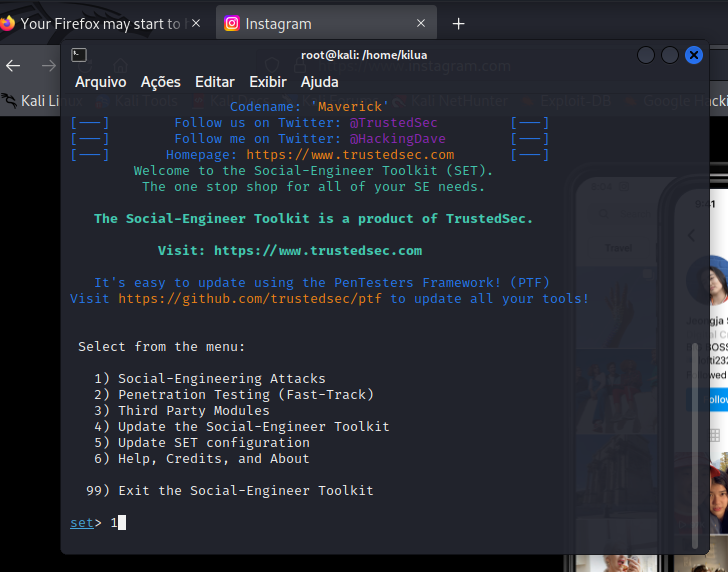
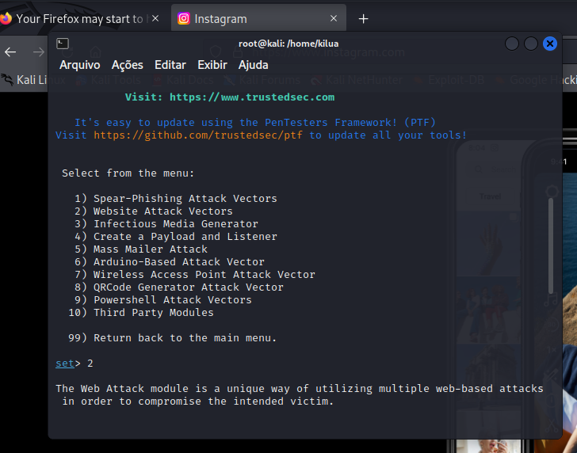
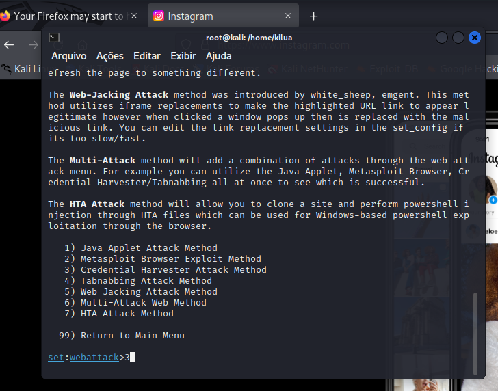
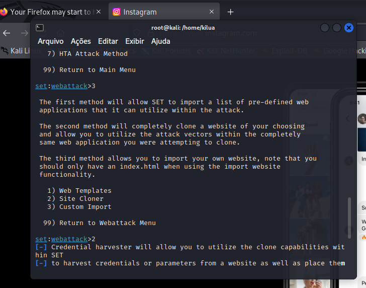
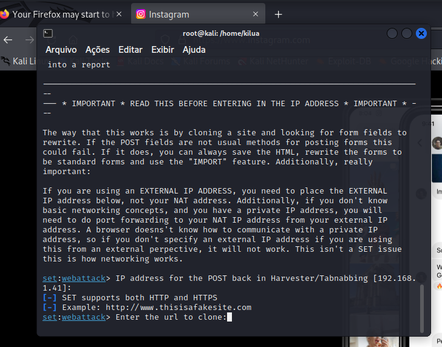
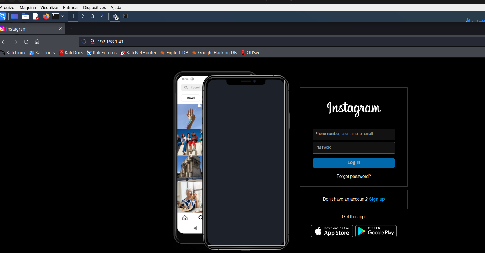
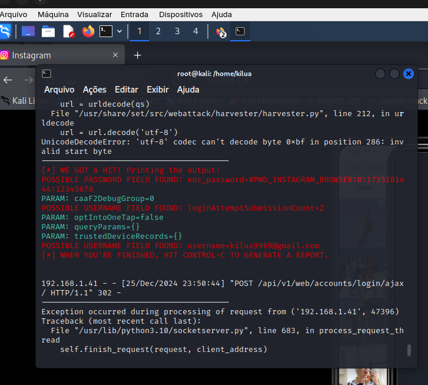

# Desafio do Pishing com Kali linux
## Objetivo: Realizar um ataque de pishing de clone de site com o objetivo de capturar as senhas de um usuário.

## Passo 1
### executar o comando setoolkit como root e escolher a opção de ataques de engenharia social

## Passo 2
### selecionar a opção website attack vectors

## Passo 3
### selecionar a opção credential harvester attack method

## Passo 4
### selecionar a opção site cloner para criar o clone do site

## Passo 5
### Confirmar o endereço ip de sua máquina virtual configurada como modo bridge no virtrual box com um Enter

## Passo 6
### Digitar a URL do site que voce deseja clonar

## Passo 7
### Copiar o ip de sua máquina virtual no navegador para abrir o clone do site copiado e entrar com o username e senha

## Passo 8
### Verificar o username e senha capturados pelo ataque no terminal do kali
